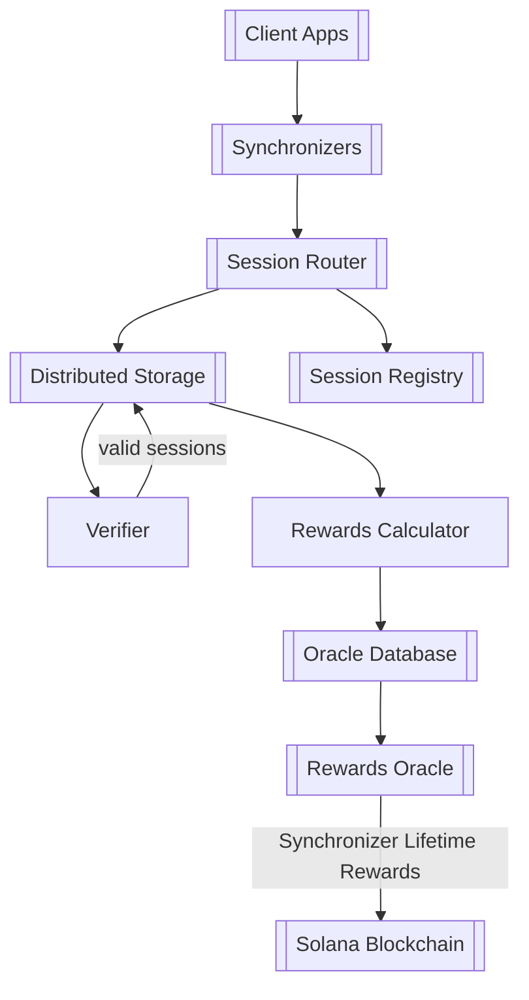
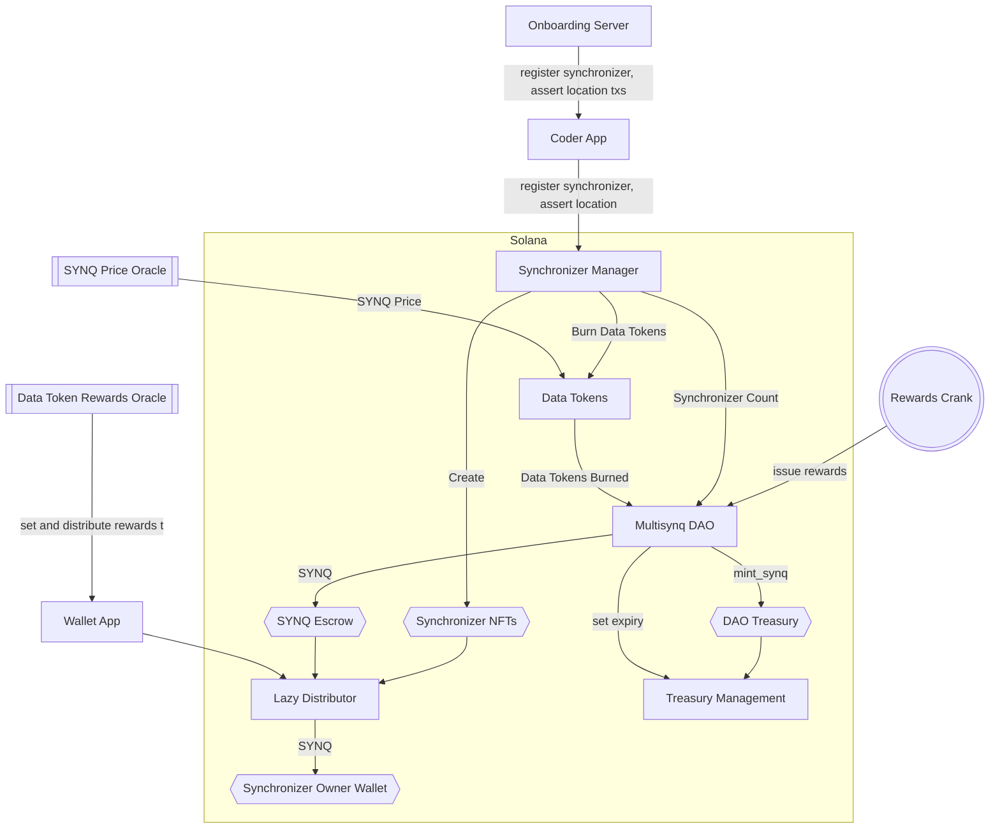

# Anchor Program

This repository contains a Solana program written using the Anchor framework. The Anchor framework provides a convenient way to build secure and maintainable Solana programs.

## Table of Contents

- [Overview](#overview)
- [Installation](#installation)
- [Usage](#usage)
- [Building and Deploying](#building-and-deploying)
- [Testing](#testing)
- [Contributing](#contributing)
- [License](#license)

## Overview

This project is a Solana program developed using the Anchor framework. It demonstrates the basic structure and functionality of an Anchor-based Solana program. The program is designed to interact with clients and other programs on the Solana blockchain.






## Installation

To install and set up the project, follow these steps:

1. **Clone the repository:**
    ```sh
    git clone https://github.com/ungaro/synq
    cd synq
    ```

2. **Install Rust and Solana CLI:**
    - [Rust](https://www.rust-lang.org/tools/install)
    - [Solana CLI](https://docs.solana.com/cli/install-solana-cli-tools)

3. **Install Anchor:**
    ```sh
    cargo install --git https://github.com/project-serum/anchor --tag v0.30.1 anchor-cli --locked
    ```

## Usage

To use this program, follow these steps:

1. **Configure Solana CLI:**
    ```sh
    solana config set --url http://localhost:8899
    ```

2. **Build the program:**
    ```sh
    anchor build
    ```

3. **Deploy the program:**
    ```sh
    anchor deploy
    ```

4. **Run the client:**
    You can interact with the deployed program using the Anchor client or other tools such as the Solana CLI or a custom front-end application.

    ```sh
    anchor run burn-mint 
    anchor run multisynq-demo
    anchor run adaptive-mesh
    ```
    burn-mint and adaptive-mesh are (WIP)
    
## Building and Deploying

To build and deploy the program to the Solana blockchain, use the following commands:

1. **Build the program:**
    ```sh
    anchor build
    ```

2. **Deploy the program:**
    ```sh
    anchor deploy
    ```

3. **Verify deployment:**
    After deploying, you can verify the deployment using the Solana Explorer or by running:
    ```sh
    solana program show <PROGRAM_ID>
    ```

## Testing

To test the program, you can write test cases using the Anchor framework. The test cases can be found in the `tests` directory. To run the tests, use the following command:

```sh
anchor test
